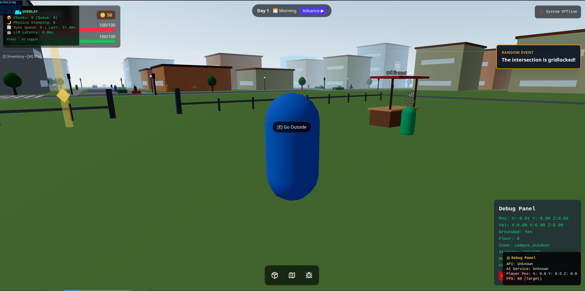

# Campus Quest 3D

A full-stack, open-world 3D campus adventure game featuring AI-driven NPCs, dynamic quest systems, and a rich, persistent world.



## 🌟 Features

- **Open World Exploration:** Navigate a multi-district campus with detailed interiors (Library, Academic Halls, Clubs) and ambient city life (Traffic, Pedestrians).
- **AI-Powered NPCs:** Interact with characters powered by LLMs (via llama.cpp) and RAG (Retrieval-Augmented Generation) for dynamic, context-aware dialogue and hints.
- **Dynamic Quest System:** Complete quests, collect items, and participate in random world events to earn rewards and build friendships.
- **RPG Mechanics:** Detailed player stats, skill trees, inventory management, and a friendship/gift system.
- **Advanced Navigation:** Fast travel via bus stops and an interactive full-screen map with points of interest (POI).
- **Responsive 3D Gameplay:** Smooth movement (walk/run/sprint/jump), stamina management, and a robust collision system.

## 🏗️ Architecture

This project is organized as a monorepo:

- **`apps/web`**: React 19 + Three.js (React Three Fiber) frontend. Uses Phaser for UI/2D elements and Zustand for state management.
- **`apps/api`**: Node.js & Express backend. Handles multiplayer synchronization, player data persistence, and core game logic with MongoDB.
- **`apps/ai-service`**: Python FastAPI service providing LLM capabilities, RAG-based knowledge retrieval, and dynamic event generation.
- **`packages/`**: Shared libraries for game data, TypeScript types, and utility functions.

## 🛠️ Tech Stack

- **Frontend:** React, Vite, Three.js, React Three Fiber, Rapier (Physics), Tailwind CSS 4, Phaser.
- **Backend:** Node.js, Express, MongoDB (Mongoose), WebSockets (ws), Zod.
- **AI/ML:** Python, FastAPI, Llama-cpp-python, ChromaDB, Sentence-Transformers.
- **DevOps:** Docker, Docker Compose, Concurrently.

## 🚀 Getting Started

### Prerequisites

- **Node.js** (v20+)
- **Python** (v3.10+)
- **MongoDB** (running locally or via Docker)
- **llama.cpp server** (for AI features)

### Installation

1. Clone the repository:
   ```bash
   git clone https://github.com/Justin21523/campus-quest-3d.git
   cd campus-quest-3d
   ```

2. Install dependencies for all workspaces:
   ```bash
   npm install
   ```

3. Setup the AI service:
   ```bash
   cd apps/ai-service
   python -m venv .venv
   source .venv/bin/activate  # or .venv\Scripts\activate on Windows
   pip install -r requirements.txt
   ```

4. Configure environment variables:
   Copy `.env.example` to `.env` and fill in your configuration.

### Running the Project

Run all services simultaneously in development mode:
```bash
npm run dev
```

The game will be available at `http://localhost:5173`.

## 📸 Media

| Feature | Description |
|---------|-------------|
| **3D World** | Immersive campus environment with dynamic lighting and fog. |
| **AI Dialogue** | Contextual conversations with NPCs. |
| **Map System** | Full-screen map with POIs and fast travel markers. |

## 📄 License

This project is licensed under the MIT License - see the LICENSE file for details.
